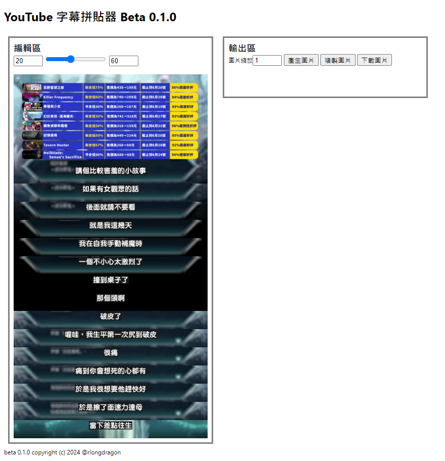
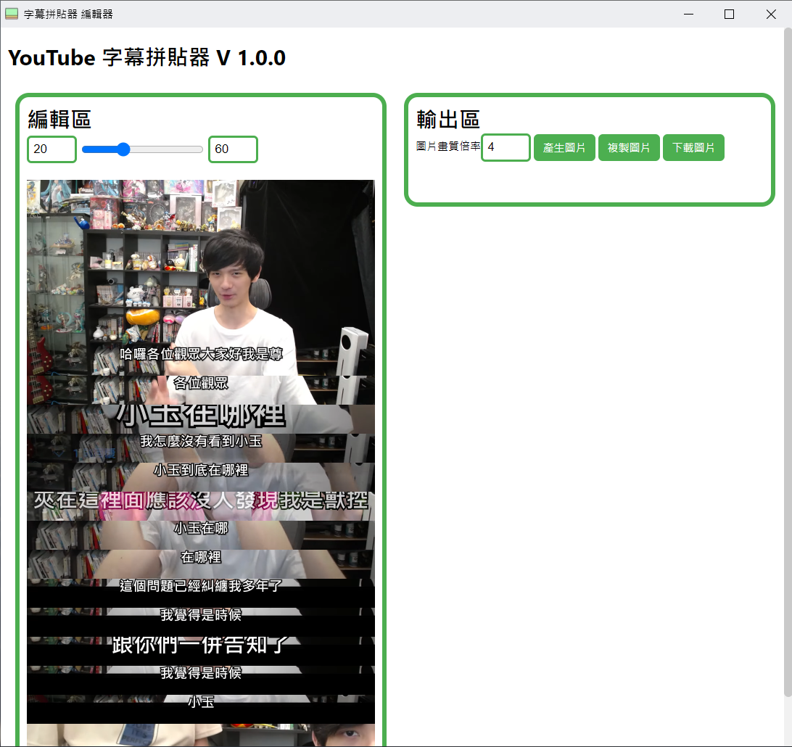
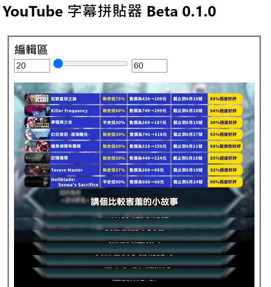

# 字幕拼貼器

這個 Chrome Extension 可以讓您快速將 YouTube 影片片段和字幕拼貼成圖片。您可以輕鬆製作梗圖、分享精彩片段。它提供一鍵截取，讓您輕鬆製作完美的 YouTube 字幕截圖。

# 開始使用

> ## 注意：
> 
> 這個項目還處於開發階段，故無發布以封裝項目。需自行開啟瀏覽器的**開發人員模式**

## 啟動擴充功能

你可以在影片網站（YouTube、巴哈姆特動畫瘋）中開啟這個擴充功能

你可以看到兩個按鈕 `開啟編輯器`以及`擷取關鍵幀`，開始使用時請先按下`開啟編輯器`開啟編輯器彈出視窗。

當你找到想記錄的關鍵幀按下`擷取關鍵幀`即可將該畫面加入至編輯器。

## 編輯拼貼圖

當你選好圖片之後，可以用上方滑桿調整字幕與畫面下緣距離。

調整好後可以在輸出區按`產生圖片`，來渲染拼貼圖，並預覽。

渲染完後你可以直接使用`複製圖片`按鈕，快速將圖片複製到剪貼簿，或是使用`下載圖片`按鈕將圖片下載至本機。

滑桿調整字幕與畫面下緣距離變化範例。

<table>
  <tr>
    <td></td>
    <td></td>
  </tr>
</table>

> 影片截圖自 YouTube [當肉Download](https://www.youtube.com/@download9331) [獨特的遊戲體驗，包山包海的補魔遊戲【Steam特賣推薦】 - YouTube](https://youtu.be/tWjtndSwvrQ?si=5camo0FG3fsaqS_p)

# 未來更新

- 畫面美化

- 針對特定雙排字幕調整

- 移除已蒐集的圖片

- 快捷鍵開啟編輯器、擷取畫面

- 特殊排版

- 偵測CC字幕自動生成

# Bug 回報、意見回饋與聯繫

本專案開發中，遇到Bug、意見回饋可以不令色開issus給我 :D

或是你可以使用 [discord](https://discordapp.com/users/601819508943880193) 或是 [Email](mailto:jz744335@gmail.com) 聯絡我