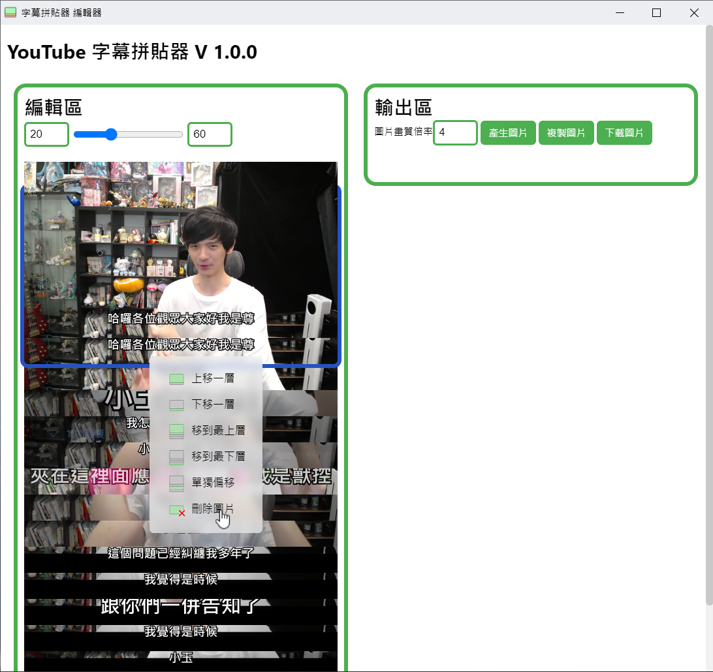
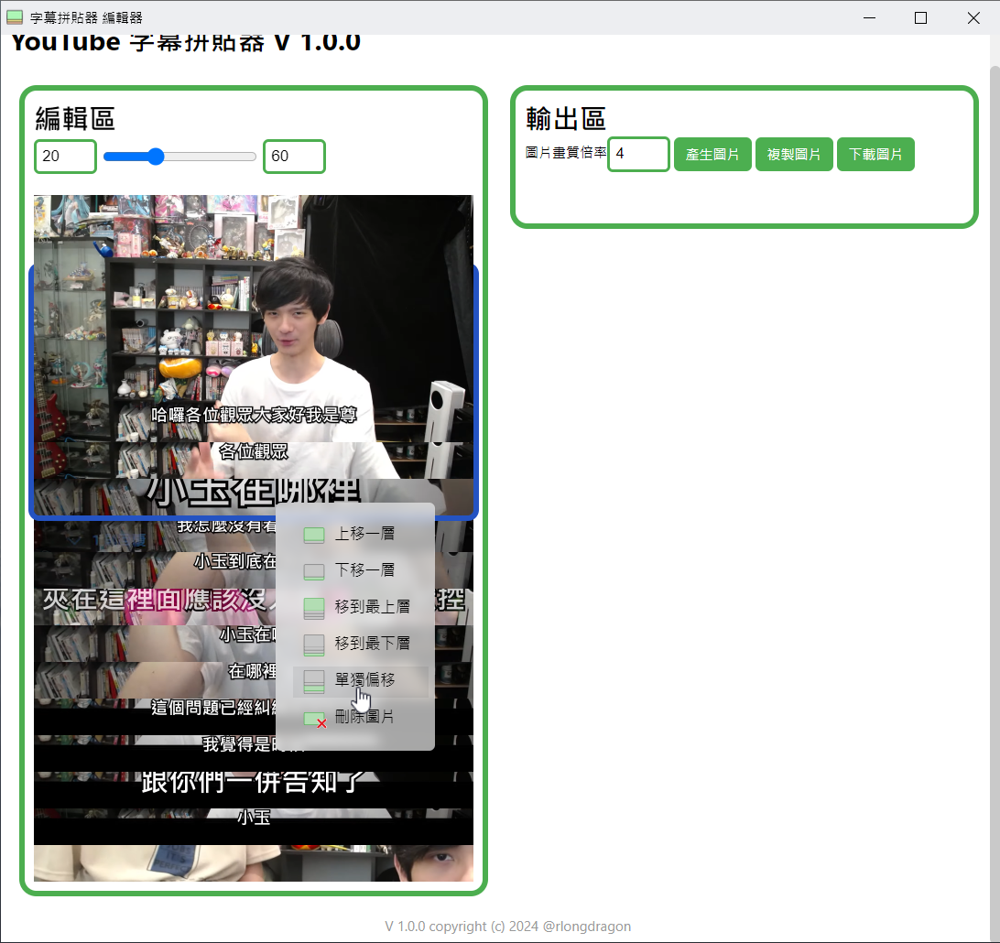
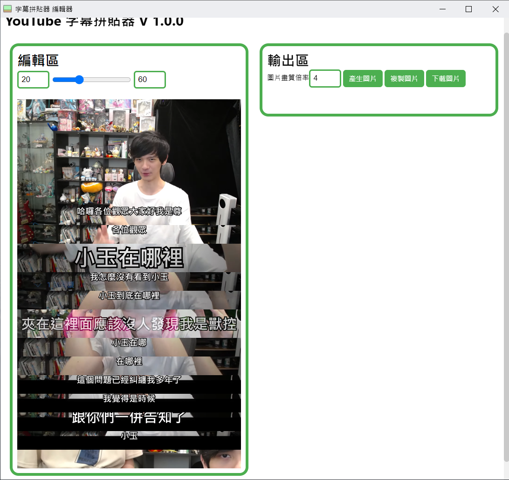
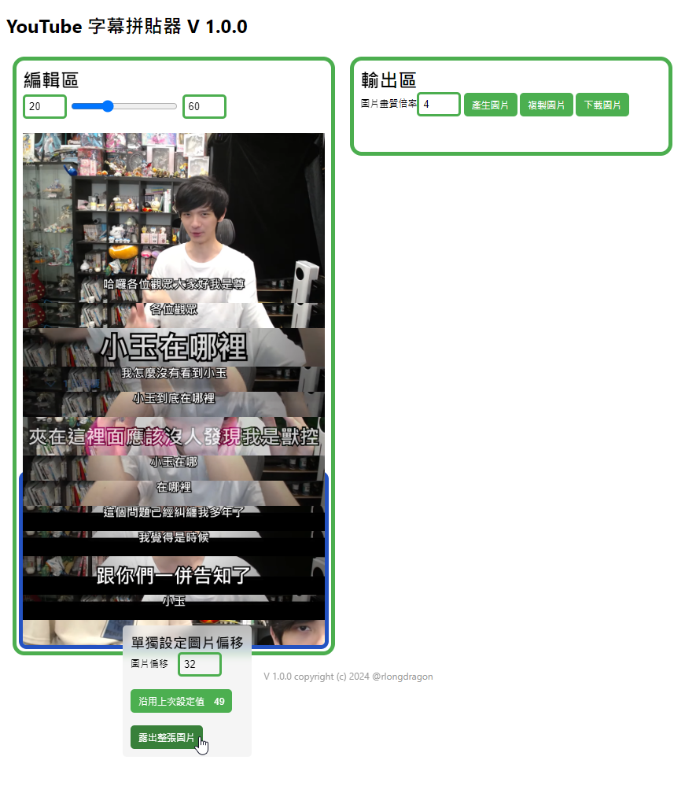

<h1>字幕拼貼器</h1>

這個 Chrome Extension 可以讓您快速將 YouTube 影片片段和字幕拼貼成圖片。您可以輕鬆製作梗圖、分享精彩片段。它提供一鍵截取，讓您輕鬆製作完美的 YouTube 字幕截圖。

# 使用說明

## 啟動擴充功能

你可以在影片網站（YouTube、巴哈姆特動畫瘋）中開啟這個擴充功能

你可以看到兩個按鈕 `擷取關鍵影格`以及`開啟編輯器`，開始使用時請先按下`開啟編輯器`開啟如下圖的彈出視窗編輯器。

當你找到想記錄的關鍵幀按下`擷取關鍵幀`即可將該畫面加入至編輯器。

> 你也可以使用 預設`Alt`(mac 為 `Option`) + `S` 快速擷取關鍵影格

## 使用編輯器

當你選好圖片之後，可以用上方滑桿調整字幕與畫面下緣距離，滑桿左右兩輸入框是滑桿的最小以及最大值，可以調整兩數值來調正滑桿的精準度。20-60就足夠應付大部分的使用場景了。

### 右鍵選單

如果你想對特定圖片進行操作（移動圖片層級、單獨設定偏移、刪除圖片等）可以對目標圖片按下右鍵。

此時會彈出右鍵選單，而被選中的圖片則會有藍色的外框。此時你可以使用右鍵選單來對圖片進行操作。

> 下面使用[人生魯宅x尊-第2頻道 - YouTube](https://www.youtube.com/@nerdzun) [【尊】我找了小玉一起來看小玉梗圖...【第二頻道】 - YouTube](https://youtu.be/Tkf8_8_nl68?si=aDExffHY4LtQBAHa) 實際應用

#### 實際範例

首先，我已經捷好了一些圖片，並且已經調整好了字幕與畫面下緣距離。

我發現我第一張圖片不小心截到兩張了，我想要將第二張圖片刪除。

<table>
  <tr>
    <td></td>
    <td></td>
  </tr>
</table>

後來我發現，影片中是先講「我覺得是時候」才講「跟你們一並告知了」。

所以我需要將兩張圖片交換位置。

<table>
  <tr>
    <td></td>
    <td></td>
  </tr>
</table>

然後我發現影片中有些字幕大小比較大，那些圖片需要下移一點。

<table>
  <tr>
    <td></td>
    <td></td>
  </tr>
</table>

下面還有幾張圖片也是要調整，這時我可以直接使用`沿用上次設定值`直接套用

<table>
  <tr>
    <td></td>
    <td></td>
  </tr>
</table>

最後，最後一張圖片是需要完整顯示出來的，所以我使用`露出整張圖片`來調整。

<table>
  <tr>
    <td></td>
    <td></td>
  </tr>
</table>

### 輸出以及儲存圖片

調整好後可以在輸出區按`產生圖片`，來渲染拼貼圖，並預覽。

渲染完後你可以直接使用`複製圖片`按鈕，快速將圖片複製到剪貼簿，或是使用`下載圖片`按鈕將圖片下載至本機。

# 未來更新

- 特殊排版

- 兼容CC字幕 

- 偵測CC字幕自動生成

# Bug 回報、意見回饋與聯繫

本專案開發中，遇到Bug、意見回饋可不吝嗇開issus給我 :D

或是你可以使用 [discord](https://discordapp.com/users/601819508943880193) 或是 [Email](mailto:jz744335@gmail.com) 聯絡我

如果你覺得這個專案對你有幫助，歡迎給我一顆星星，這可以給我有很大的動力持續更新。